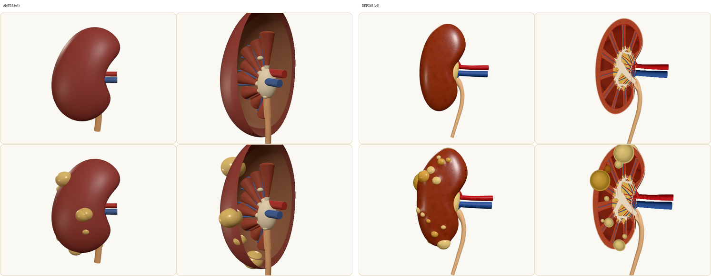

# Rim 3D no home — investigação e proposta

Data: 2026-09-17. Investigado com 3 subagentes (scout do repo + 2 researchers web).

## Onde encaixa (repo)

- A explicação da doença vive no **start-here** (`src/start-here/index.njk`,
  `startHere.scopeTitle/scopeBody`), não no home. O home tem: `.hero` →
  `.section--latest` → secção "How to read" → `.section--muted` (curadoria).
- Slot de inserção: nova `<section class="section" aria-labelledby="kidney3d-heading">`
  entre o fim do bloco "How to read" (`howGuideLink`) e o bloco `section--muted`,
  em `src/index.njk` e `src/pt/index.njk`.
- Copy bilingue em `src/_data/i18n.js` (`i18n.{en,pt}.home.kidney3d*`) — nunca
  hardcoded. Estilos `.kidney3d-*` em `src/css/main.css`; JS em `src/js/kidney3d.js`
  carregado só no home (não em `base.njk`).
- three.js **não existe** no projeto (bundle atual ~35 KB: CSS 28 KB + JS 6,5 KB;
  three.js cheio ~600 KB). Lighthouse exige performance ≥ 0,9 e a11y ≥ 0,95.

## Opções 3D avaliadas

| Opção                                                                                                     | Licença                                                   | Veredito                                                           |
| --------------------------------------------------------------------------------------------------------- | --------------------------------------------------------- | ------------------------------------------------------------------ |
| `three` + GLB próprio (rim Z-Anatomy ou BodyParts3D decimado, Draco) + quistos PKD procedurais toggláveis | CC-BY-SA 4.0 / CC-BY-SA 2.1 JP (atribuição visível PT+EN) | **Recomendado**                                                    |
| Procedural three.js puro (rim estilizado + quistos)                                                       | —                                                         | Fallback / alternativa leve para o toggle saudável-vs-poliquístico |
| NIH 3D Print Exchange                                                                                     | varia **por modelo** (§4.3 dos Termos)                    | Só com entrada marcada CC0/CC-BY verificada                        |
| BioDigital (iframe/API)                                                                                   | planos School/Business pagos                              | **Evitar** (paywall, sem offline, sem controlo)                    |

Detalhe: `GLTFLoader` é addon (`three/addons/loaders/GLTFLoader.js`, exemplo
`webgl_loader_gltf`); Draco/KTX2 exigem decoders acoplados (`setDRACOLoader()`,
`setKTX2Loader()`). GLB alvo ≤ 1–3 MB, lazy-load via `import()` +
`IntersectionObserver`, `pixelRatio` limitado, sem auto-rotação por defeito.

## UX (doentes + clínicos)

- 3 vistas por botão (Externo / Corte coronal / Quistos), labels HTML ancoradas a
  pontos 3D (não texto em textura), toggle saudável-vs-poliquístico (quistos =
  grupo de malha separado + slider de severidade).
- Controlos por teclado/botões com nomes bilingues, canvas `aria-hidden` +
  alternativa textual (tabela de estruturas), `prefers-reduced-motion` congela
  animação, fallback `<noscript>` + imagem estática.
- `@media print`: esconder canvas, mostrar figura/caption estática.
- Disclaimer educativo junto ao visual (eco de `howSafety`/`startHere.disclaimer`).

## Union Alpha — o que é e para que serve aqui

- "Union Alpha" = **um** modelo stealth, não família: OpenRouter
  `stealth/union-alpha` (preview gratuito, texto+imagem, ~262k contexto,
  research/coding/agentic); no OpenCode Zen como `opencode-go/union-alpha`.
  "OpenCL Go" não existe — confusão provável com **OpenCode CLI/Zen** ou o
  **OpenRouter Go SDK** (`github.com/OpenRouterTeam/go-sdk`).
- É modelo texto+imagem, **não gera geometria 3D**. Papel realista: gerar as
  labels e explicações bilingues, Q&A grounded em metadados, ajuda contextual.
- Teste via subagente com `model: opencode-go/union-alpha` (2026-09-17):
  primeira tentativa falhou no provider (`Anthropic stream ended without a
stop reason`); retry com pedido mais curto passou e devolveu labels PT/EN
  corretas (córtex, medula, pelve renal, ureter, quisto) + disclaimer bilingue.
  Veredito: modelo utilizável via subagentes para gerar copy bilingue; para
  tarefas longas, preferir pedidos curtos.

## Próximos passos

1. Descarregar rim BodyParts3D (OBJ) e Z-Anatomy (`.blend`); comparar polígonos,
   exportar GLBs decimados (teste Draco vs Meshopt); fixar licença do artefacto.
2. Protótipo Eleventy: ilha three.js lazy + `kidney3d.js`, toggle + vistas +
   fallback estático; testes Playwright/axe + budget Lighthouse.
3. Registar resultado do teste Union Alpha e decidir uso (labels/Q&A) no PR.

## v2 do modelo procedural (2026-10-07)

Pergunta: dá para fazer um rim 3D melhor? Sim, sem assets novos (continua
100 % procedural em `src/js/kidney3d.js`, 0 KB extra de rede; o GLB
BodyParts3D/Z-Anatomy fica como opção futura com atribuição CC-BY-SA).

Problemas da v1 (screenshots com SwiftShader):

- Forma = esfera deformada: "feijão" largo demais (proporção ~2,6 × 2 × 1,6),
  hilo como mossa genérica.
- Corte = casca oca (`BackSide`) cortada em x: lia-se como uma tigela vazia;
  pirâmides eram cilindros num leque, sem colunas renais legíveis.
- Plano de corte fixo no mundo: ao rodar, o corte "deslizava" pelo rim.
- Quistos = esferas pousadas por fora; no corte não apareciam como cavidades.

O que a v2 faz:

- **Forma anatómica**: superfície "lente" varrida sobre um contorno coronal 2D
  (11 × 6 × 3 cm), polo superior mais largo, eixo inclinado (polo superior
  medial), hilo com seio renal, gordura hilar, veia anterior / artéria /
  pelve-ureter posterior, ureter afunilado a descer medial ao polo inferior.
- **Corte coronal sólido**: como a secção em z = 0 é exatamente o contorno, a
  face de corte é desenhada em camadas planas — córtex granular, colunas
  renais, 9 pirâmides estriadas com papilas, cálices menores → maiores →
  pelve, gordura do seio lobulada, artérias/veias segmentares, interlobares,
  arqueadas e radiadas corticais, cápsula fibrosa. Ureter e vasos cortados
  mostram o lúmen.
- **Plano de corte no referencial do rim**: o corte acompanha a rotação; a
  vista de corte não auto-roda (para se conseguir ler).
- **Quistos PKD**: um único conjunto de esferas dentro do parênquima; os
  superficiais levantam a cápsula (deformação suave da malha → superfície
  bosselada), os que atravessam o plano aparecem no corte como cavidades com
  parede fina; paleta inclui quistos hemorrágicos/proteináceos. A carga
  (1–5) aumenta número, tamanho e o volume renal (até ~1,45×), com a câmara a
  recuar menos do que o crescimento para o aumento ser visível.
- Desempenho: render on-demand (só a vista exterior a rodar desenha todos os
  frames; corte, reduced-motion e rato parado não gastam GPU). Um mapa de
  ambiente PMREM foi testado e retirado: duplicava o custo por pixel
  (SwiftShader 7 → 14 fps sem ele) com pouco ganho visual. Malha da cápsula
  144 × 60. Init ~1,1 s em SwiftShader (v1: ~1,0 s).

Próximos passos possíveis: etiquetas HTML ancoradas a pontos 3D (cálices,
papila, coluna renal); fallback SVG redesenhado a partir do mesmo contorno;
comparar com GLB BodyParts3D decimado se se quiser ainda mais fidelidade.

## Fontes

- three.js: [Loading 3D Models](https://threejs.org/manual/en/loading-3d-models.html),
  [GLTFLoader](https://threejs.org/docs/pages/GLTFLoader.html),
  [DRACOLoader](https://github.com/mrdoob/three.js/blob/dev/docs/pages/DRACOLoader.html.md)
- BodyParts3D: [licença CC-BY-SA 2.1 JP](https://dbarchive.biosciencedbc.jp/en/bodyparts3d/lic.html)
- Z-Anatomy: [GitHub](https://github.com/Z-Anatomy/Models-of-human-anatomy)
  (CC-BY-SA 4.0), [Zenodo](https://zenodo.org/records/4953712)
- NIH 3D: [portal](https://3d.nih.gov/), [Termos §4.3](https://3d.nih.gov/terms)
- BioDigital: [publish/embed](https://support.biodigital.com/hc/en-us/articles/225773768-Publish-a-3D-model),
  [pricing](https://pricing.biodigital.com/business.html)
- OpenRouter: [stealth/union-alpha](https://openrouter.ai/stealth/union-alpha),
  [quickstart](https://openrouter.ai/docs/quickstart),
  [Go SDK](https://openrouter.ai/docs/client-sdks/go/overview)
- OpenCode: [Zen](https://opencode.ai/docs/zen/), [CLI](https://opencode.ai/docs/cli/)
- a11y: [MDN prefers-reduced-motion](https://developer.mozilla.org/)
